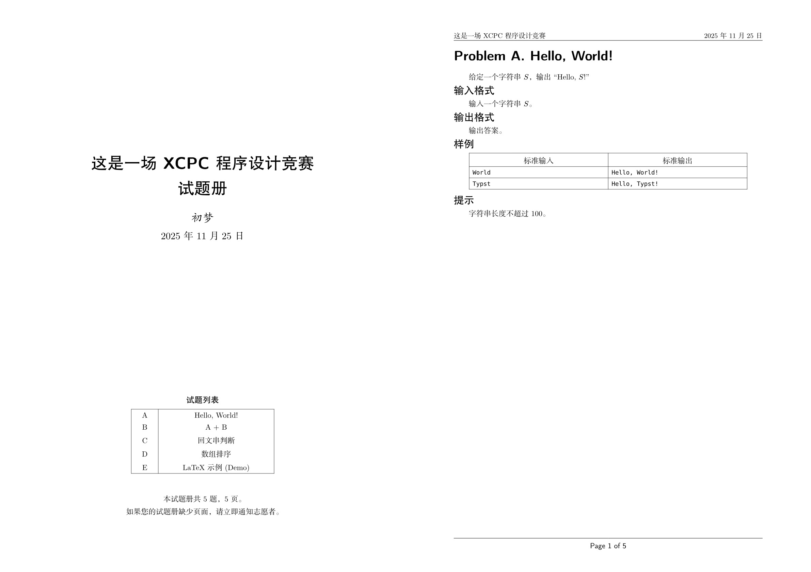

# Olymp in Typst

A Typst template for generating competitive programming contest problem sets (similar to ICPC/XCPC format, inspired by olymp.sty). Create beautifully formatted PDF contest booklets with minimal effort.



## Features

- **Professional Formatting**: Generate contest booklets with title pages, table of contents, and consistent problem layouts
- **Chinese & Math Support**: Optimized for Chinese text with full mathematical notation support
- **Sample Cases**: Automatic rendering of input/output samples in professional tables
- **Auto-numbering**: Problems automatically labeled as "Problem A", "Problem B", etc.
- **LaTeX Support**: Optional LaTeX rendering via mitex for problems requiring complex formatting
- **Customizable**: Easy to adapt contest metadata, styling, and fonts
- **PDF Output**: Direct PDF generation suitable for contest distribution

## Prerequisites

- [Typst](https://typst.app/) installed
- Chinese fonts (FZShuSong-Z01, FZHei-B01, FZKai-Z03) for optimal rendering
- CMU fonts (cm-unicode)

## Usage

This template provides two ways to use the `template.typ` file:

### Method 1: Apply as a Complete Template (Recommended)

Apply the template to your document using `#show` rule, as demonstrated in `main.typ`. This is the easiest way to get started:

```typst
#import "template.typ": contest-conf
#import "problems.typ": problems  // or import from your problems file

#show: contest-conf.with(
  title: "XCPC Programming Contest",
  subtitle: "Problem Set",
  author: "Your Name",
  problems: problems
)
```

This automatically handles:
- Title page generation
- Table of contents
- Consistent problem formatting
- Page layout and styling

### Method 2: Import Utility Functions

Import specific functions from `template.typ` and use them in your own document:

```typst
#import "template.typ": render-problem, maketitle

// Use individual functions as needed
#maketitle(title: "Contest Name", author: "Your Name")

// Render problems manually
#for problem in problems {
  render-problem(problem.problem, problem.statement)
  pagebreak()
}
```

## Quick Start

1. Clone or download this template
2. Edit `problems.json` to add your contest problems (see structure below)
3. Build the PDF:
   ```bash
   typst compile main.typ
   ```

## Problem Structure

Define your contest problems in `problems.json` using the following JSON format:

```json
[
  {
    "problem": {
      "display_name": "Your Problem Name",
      "latex": false,
      "samples": [
        {
          "input": "sample input",
          "output": "sample output"
        },
        {
          "input": "another input",
          "output": "another output"
        }
      ]
    },
    "statement": {
      "description": "Problem description with mathematical expressions like $x^2 + y^2 = z^2$.",
      "input": "Input format description.",
      "output": "Output format description.",
      "notes": "Optional constraints and hints."
    }
  }
]
```

You can also define problems directly in `problems.typ` using Typst syntax - see the template for both approaches.

### Problem Components

- **`problem.display-name`**: The title of your problem
- **`problem.latex`**: Set to `true` to render statement fields as LaTeX using mitex (default: `false`)
- **`problem.samples`**: Array of sample input/output pairs for problem clarification
- **`statement.description`**: Full problem description (supports math notation with `$...$`)
- **`statement.input`**: Format specification for input data
- **`statement.output`**: Format specification for output data
- **`statement.notes`**: Optional constraints, hints, or additional notes

### LaTeX Support

If you set `"latex": true` in the problem object, the template will use the [mitex](https://github.com/mitex-rs/mitex) package to render LaTeX content. This is useful when:

- You have existing LaTeX problem statements you want to reuse
- You need more complex LaTeX features beyond Typst's math mode
- You're migrating from LaTeX-based contest systems

Example with LaTeX enabled:
```json
{
  "problem": {
    "display_name": "Complex LaTeX Problem",
    "latex": true,
    "samples": [...]
  },
  "statement": {
    "description": "Given a function $f(x) = \\frac{x^2 + 1}{x - 1}$, calculate...",
    "input": "The input contains an integer $n$.",
    "output": "Output the result as \\\\textbf{\\frac{result}{2}}$.",
    "notes": "Constraints: $0 \\\\le n \\\\le 10^9$"
  }
}
```

## API Reference

### `contest-conf`

Main template function that applies the complete contest configuration to your document.

**Parameters:**
- `title` (str, optional): Contest title (default: "这是一场 XCPC 程序设计竞赛")
- `subtitle` (str, optional): Contest subtitle (default: "试题册")
- `author` (str, optional): Contest author (default: "初梦")
- `date` (str, optional): Contest date (default: current date)
- `problems` (array, required): Array of problem objects (see Problem Structure)
- `enable-titlepage` (bool, optional): Whether to generate title page (default: `true`)
- `doc` (content, required): Document content (automatically provided by `#show` rule)

**Returns:** Formatted contest document with all problems

**Usage:**
```typst
#show: contest-conf.with(title: "My Contest", problems: problems)
```

### `render-problem`

Renders an individual problem with consistent formatting.

**Parameters:**
- `problem` (dictionary): Problem metadata containing:
  - `display-name` (str): Problem title (will be prefixed with "Problem A/B/C...")
  - `samples` (array): Array of sample cases (each with `input` and `output`)
- `statement` (dictionary): Problem statement containing:
  - `description` (content): Problem description (supports math notation)
  - `input` (content, optional): Input format specification
  - `output` (content, optional): Output format specification
  - `notes` (content, optional): Constraints and hints

**Returns:** Rendered problem content

**Usage:**
```typst
#for problem in problems {
  render-problem(problem.problem, problem.statement)
  pagebreak()
}
```

### `maketitle`

Creates a professional title page for the contest.

**Parameters:**
- `title` (str, optional): Main title (default: `none`)
- `subtitle` (str, optional): Subtitle (default: `none`)
- `author` (str, optional): Author name (default: `none`)
- `date` (str, optional): Date (default: `none`)

**Returns:** Formatted title page content

**Usage:**
```typst
#maketitle(title: "Contest 2024", author: "Contest Org")
```

### `fonts`

Font configuration dictionary (not a function, but a constant).

**Contains:**
- `serif` (array): Serif font stack ("New Computer Modern", "FZShuSong-Z01")
- `sans` (array): Sans-serif font stack ("CMU Sans Serif", "FZHei-B01")
- `kaishu` (array): Kaishu font stack ("FZKai-Z03")

**Usage:**
```typst
#text(font: fonts.sans)[Sans-serif text]
```

## License

GPL-3.0-or-later

## Contributing

Suggestions and improvements are welcome! This template aims to be a versatile starting point for contest organizers.